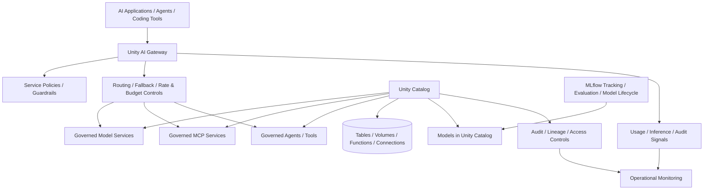

# Databricks AI Governance Reference

A reference architecture for governing enterprise AI on Databricks using Unity Catalog as the unified governance layer and Unity AI Gateway as the runtime control plane for model, agent, MCP, and tool traffic.

> **Platform note (August 2026):** Unity AI Gateway and related service policies are currently documented by Databricks as Beta features. This project treats them as emerging platform capabilities and separates stable architecture principles from preview-specific implementation details.

## What this demonstrates

- Centralized governance for data and AI assets with Unity Catalog
- Governed model services and controlled access to LLM endpoints
- Model, agent, MCP, and tool traffic routed through an AI governance control plane
- Rate, budget, routing, fallback, and service-policy concepts
- Asset permissions, lineage, auditing, and discovery
- Model lifecycle governance with MLflow and Models in Unity Catalog
- Separation between data governance, AI traffic governance, and application-specific business policy

## Reference architecture

## Governance model

### 1. Asset governance

Use Unity Catalog to manage governed access to data and AI assets. The architecture treats models, functions, connections, MCP services, and other AI resources as securable assets rather than application-local configuration.

### 2. Runtime AI governance

Route model and tool traffic through Unity AI Gateway where appropriate so teams can apply centralized access, routing, usage, cost, and service-policy controls instead of embedding those controls independently in every application.

### 3. Application policy

Platform governance does not replace business policy. Applications should still validate user intent, tool arguments, transaction limits, approval requirements, and domain-specific rules before performing material actions.

### 4. Evaluation and lifecycle

Use MLflow and Models in Unity Catalog for experiment tracking, evaluation, governed model lifecycle, lineage, and deployment-related controls. Evaluation should cover quality, grounding, safety, latency, and cost.

## Illustrative policy code

[`src/policy_engine.py`](./src/policy_engine.py) demonstrates how an application can add deterministic business policy on top of platform governance. It is intentionally SDK-independent so the control pattern is clear.

## Example control matrix

| Control | Platform layer | Application layer |
|---|---|---|
| Data access | Unity Catalog privileges / policies | User-context filtering |
| Model access | Governed model service access | Use-case allowlist |
| Tool exposure | Governed MCP/tool configuration | Per-workflow allowlist |
| Content controls | Service policies / guardrails | Domain-specific validation |
| Cost controls | Gateway rate/budget controls | Workflow quotas |
| High-risk actions | Platform permissions | Human approval / transaction policy |
| Lineage & audit | Unity Catalog / platform logs | Business event audit trail |
| Quality | MLflow / evaluation tooling | Product-specific acceptance thresholds |

## Official references

- Databricks AI governance guide: https://docs.databricks.com/aws/en/ai-gateway/ai-governance
- Unity AI Gateway: https://docs.databricks.com/aws/en/ai-gateway/
- Unity Catalog overview: https://docs.databricks.com/aws/en/data-governance/unity-catalog/
- Models in Unity Catalog: https://docs.databricks.com/aws/en/machine-learning/manage-model-lifecycle

## Design principle

The most important design choice is to avoid treating AI governance as only a prompt-filtering problem. Enterprise governance spans **who can access the asset, what traffic can reach it, what the model or agent may do, what data it may use, how actions are approved, and how the complete interaction is observed and audited**.
