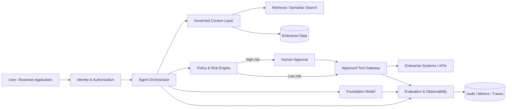

# Enterprise Agentic AI Reference Architecture

A vendor-neutral reference architecture for building enterprise AI agents that can reason over governed context, call approved tools, and escalate material actions for human approval.

## What this demonstrates

- Agent orchestration separated from tool execution
- Governed retrieval and enterprise context
- Identity-aware authorization
- Tool allowlists and action risk classification
- Human-in-the-loop approval for high-impact actions
- Evaluation, tracing, cost, and latency observability
- Clear trust boundaries between model output and enterprise systems

## Reference architecture

## Request lifecycle

1. Authenticate the user and resolve effective permissions.
2. Retrieve only context the user is authorized to access.
3. Ask the model for a structured plan rather than directly executing generated text.
4. Validate proposed tools and arguments against an allowlist and policy rules.
5. Require human approval when the action crosses a defined risk threshold.
6. Execute through a controlled tool gateway.
7. Record inputs, retrieved sources, tool calls, outcomes, latency, quality, and cost signals.
8. Return a grounded response with traceable provenance where appropriate.

## Trust boundaries

The model is treated as a probabilistic reasoning component, not an authorization system. The architecture therefore keeps identity, permissions, data access, policy enforcement, and tool execution outside the model boundary.

## Illustrative code

[`src/orchestrator.py`](./src/orchestrator.py) shows a compact Python pattern for structured plans, risk checks, allowlisted tools, and approval routing without depending on any proprietary SDK.

## Production considerations

- Use short-lived workload identity instead of embedded credentials.
- Validate tool arguments against schemas before execution.
- Protect sensitive prompts and retrieved context using the same access controls as the underlying data.
- Maintain replayable traces for incident review and evaluation.
- Add rate, spend, and token controls per user/application/workload.
- Establish offline and online evaluation datasets before expanding autonomy.

## Where this fits

This pattern can be implemented with enterprise AI stacks such as Databricks, Microsoft Azure/Fabric, or other model and orchestration platforms while keeping governance and execution controls explicit.
