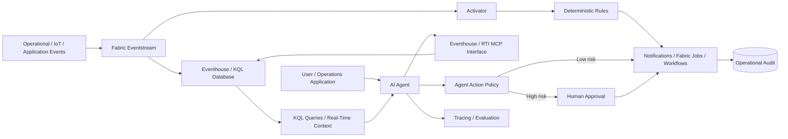

# Microsoft Fabric Real-Time Agentic Intelligence

A reference architecture for combining Microsoft Fabric Real-Time Intelligence with AI agents so real-time operational signals can be queried, reasoned over, and turned into governed actions.

> **Platform note (August 2026):** Microsoft documents AI agents for Fabric Real-Time Intelligence as Preview. This project uses those capabilities as an emerging implementation option while keeping the underlying event-driven architecture vendor-neutral.

## What this demonstrates

- Event-driven ingestion with Eventstream
- Real-time storage and analytics with Eventhouse / KQL databases
- Natural-language and agent access to live operational data
- Model Context Protocol (MCP) as a controlled interface to real-time data and capabilities
- Deterministic event rules and actions with Activator
- Separation of automated detection, AI reasoning, and material business actions
- Human approval for high-impact outcomes

## Reference architecture

## Design pattern

### Detect

Use Eventstream and Activator for deterministic, repeatable detection when a known threshold or event pattern is sufficient.

### Understand

Use Eventhouse and KQL to provide time-aware operational context. An AI agent can use an approved MCP interface or application service to inspect schema, query relevant data, and summarize what is happening.

### Decide

Keep high-impact decisions outside free-form model output. Convert agent recommendations into structured proposed actions that are validated against explicit business policy.

### Act

Route low-risk actions to approved automation. Require human approval when an action changes customer state, financial state, security posture, production infrastructure, or other material business outcomes.

## Example scenario

A service health stream reports elevated failure rates.

1. Eventstream lands the telemetry in Eventhouse.
2. Activator detects a defined threshold breach and opens an operational signal.
3. An agent queries recent KQL context to compare error rate, affected regions, release changes, and correlated events.
4. The agent proposes a structured response such as `notify`, `open_incident`, or `request_rollback`.
5. Policy permits notification automatically but requires approval for rollback.
6. The full decision and action trail is retained for operations review.

## Illustrative code

[`src/action_policy.py`](./src/action_policy.py) demonstrates risk-aware handling of structured actions proposed from real-time analysis.

## Official references

- Get started with Real-Time Intelligence: https://learn.microsoft.com/en-us/fabric/real-time-intelligence/get-started-with-real-time-intelligence
- Build AI agents for Real-Time Intelligence (Preview): https://learn.microsoft.com/en-us/fabric/real-time-intelligence/ai-agents-eventhouse
- Activator documentation: https://learn.microsoft.com/fabric/real-time-intelligence/data-activator/
- Eventstream destinations: https://learn.microsoft.com/en-us/fabric/real-time-intelligence/event-streams/add-manage-eventstream-destinations

## Architecture principle

Real-time AI should not replace deterministic event processing when the condition is already known. A strong enterprise design uses **rules for known conditions, AI for interpretation and ambiguity, and explicit policy for actions**.
