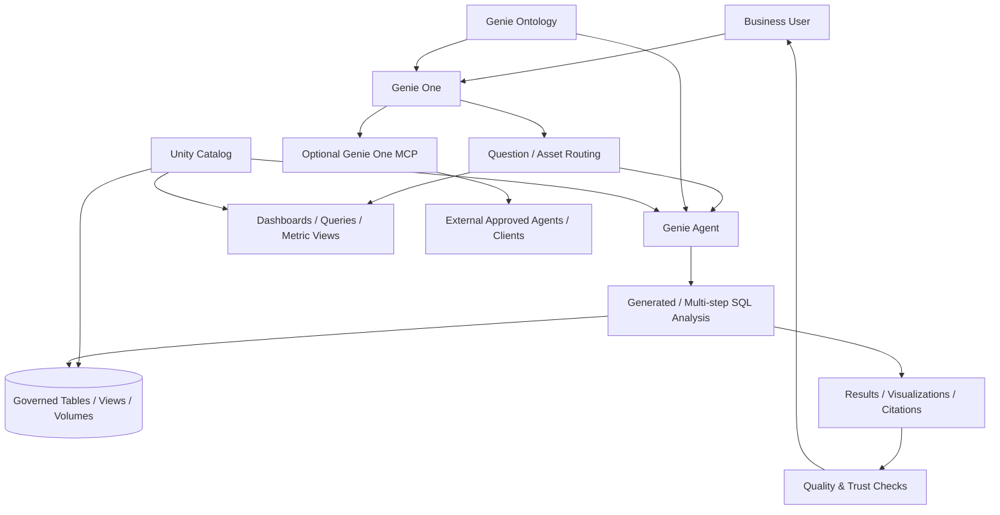

# Governed Conversational BI with Databricks Genie

A reference architecture for delivering natural-language analytics over governed enterprise data using the current Databricks Genie family: Genie One for business users, Genie Agents for domain-specific trusted analytics, Genie Ontology for business context, and Unity Catalog for permissions and governance.

> **Naming note (August 2026):** Databricks renamed Genie Spaces to **Genie Agents**. Genie Ontology is documented as Public Preview, and some MCP/agent integrations are Beta. This project uses the current terminology while clearly separating preview capabilities from core design principles.

## What this demonstrates

- Business-user access through Genie One
- Domain-specific trusted analytics through Genie Agents
- Curated datasets, sample SQL, expressions, instructions, and verified business context
- Business semantics and authoritative-source selection with Genie Ontology
- Unity Catalog permissions enforced across data access
- Quality gates for ambiguous, sensitive, or low-confidence questions
- Citation and provenance expectations for trusted enterprise analytics
- A path from conversational BI to broader agentic workflows without bypassing governance

## Reference architecture

## Trust model

### Govern the data first

Conversational BI is trustworthy only when the underlying data, permissions, lineage, and authoritative assets are governed. Unity Catalog remains the access-control foundation.

### Curate domain context

A Genie Agent should be deliberately configured for a business domain using the right datasets, descriptions, sample SQL, business expressions, instructions, and verified answers. Broad access to every table is usually worse than a smaller trusted analytical surface.

### Use ontology as business context, not as authorization

Genie Ontology can help identify metric definitions, authoritative sources, and business rules. Authorization still comes from governed permissions. Business context should improve interpretation without weakening access controls.

### Treat ambiguity explicitly

A production conversational analytics experience should recognize questions that are underspecified. For example, `revenue`, `customer`, `active`, or `margin` can have multiple valid definitions. When the business meaning cannot be resolved confidently from trusted context, ask a clarifying question rather than manufacture certainty.

## Quality gate

[`src/question_quality_gate.py`](./src/question_quality_gate.py) shows an illustrative pre-query check that flags ambiguous terms, sensitive intents, and missing domain context before a conversational request proceeds.

## Example interaction

**Question:** "Why did revenue decline last week?"

A strong implementation should:

1. Resolve the correct revenue definition and authoritative data source.
2. Apply the user's effective permissions.
3. Identify the relevant date comparison and business dimensions.
4. Generate one or more analytical queries.
5. Validate that returned evidence supports the explanation.
6. Present results with the generated analysis, relevant visualizations, and citations/provenance where available.
7. State uncertainty when the evidence is incomplete.

## Official references

- Genie overview: https://docs.databricks.com/aws/en/genie/
- Genie One: https://docs.databricks.com/aws/en/genie-one
- Chat in Genie One and Genie Ontology: https://docs.databricks.com/aws/en/genie-one/chat
- Genie Agents: https://docs.databricks.com/aws/en/genie-agents/
- Create and manage a Genie Agent: https://docs.databricks.com/aws/en/genie/set-up
- Genie One MCP server: https://docs.databricks.com/gcp/en/agents/mcp/genie-mcp

## Architecture principle

Conversational BI should not be measured only by whether it can generate SQL. The enterprise success criteria are **semantic correctness, governed access, traceable evidence, understandable uncertainty, and repeatable answers to important business questions**.
